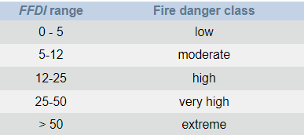
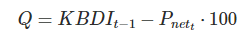

```{r setup, include=FALSE}
library(readr)
library(ggplot2)
library(lubridate)
library(dplyr)
library(ReIns)
library(extRemes)
devtools::install_github("EcoFire/firebehavioR")
library(firebehavioR)
# Setup of options for the rmarkdown document
knitr::opts_chunk$set(echo = TRUE, # By default, codes are shown
                      warning = FALSE, # Warnings are not printed
                      message = FALSE, # Messages are not printed
                      out.width = "90%",
                      fig.align = 'center') # Codes results are cached into a 
# dedicated _cache directory which should be ignored by git (and emptied regularly)
## https://bookdown.org/yihui/rmarkdown/markdown-syntax.html pour des tips
```

# Introdution

## Intérêt général des indices
## Types d'indices

# Indices étudiés  {.tabset}

## Fosberg Fire Weather Index (FFWI)

## FWI Canadien

## Angstrom Index

## MacArthur Grassland Mark 5 Index

L'indice de danger d'incendie de forêt de McArthur (FFDI) est largement utilisé en Australie comme base pour l'émission d'avertissements météorologiques en cas d'incendie. Il est associé à un ensemble de seuils de classification allant de faible à extreme que l'on peut voir ci-dessous:

````{r}

````

La formulation de l'indice FFDI prend en compte la température du jour à 15H( °C), T, la vitesse du vent (km/h), v, et l'humidite relative (%), RH. Il y'a egalement une composante représentant la disponibilité du combustible appelée le facteur de sécheresse, DF.
Nous verrons la formule mathematique associee dans la prochaine partie.

# Discussion comparative des formules

## Variables d'entrée

### MacArthur Grassland Mark 5 Index

L'indice McArthur est basé sur les valeurs quotidiennes de la température, de l'humidité relative, de la vitesse du vent et des précipitations des dernières 24 heures. C'est ce qu'on appelle un indice dynamique puisqu'il depend desconditions meteorologiques des jours precedents.Voici la formule mathematique associee a cet indice :

````{r}
knitr::include_graphics("Mc arthur.png")
````

ou H15 est l'humidité relative de l'air [%], T15 la température de l'air [°C], U15 la vitesse du vent [km/h] et DF un facteur de sécheresse exprimé en fonction de l'indice KBDI (comme on l'a vu plus haut), la formule de ce dernier est la suivante :

````{r}
knitr::include_graphics("Mc arthur2.png")
````

Le coeffecient KBDI est calculé de la façon suivante :

````{r}
knitr::include_graphics("KBDI.png")
````

Avec Q qui vaut :

````{r}

````

## Statique vs Dynamique

## Échelles temporelles

# Implémentation des calculs {.tabset}

Nous commençons par exploiter les données recueillies par la station de Salon-de-Provence.
Nous avons également utilisé la base de données en ligne Prométhée afin de recueillir la totalité des incendies ayant eu lieu sur la période étudiée dans le département. Cela nous permettra de confronter les indices avec la réalité.   

```{r data_loading, warning=FALSE, message=FALSE, cache=TRUE}
```{r data_loading, warning=FALSE, message=FALSE, cache=TRUE}
  RR_81_99 <- read_delim("data/Construction_FWI_horaire_METEO_STATION_RR_81-99.csv",delim = ";", escape_double = FALSE, trim_ws = TRUE)
  RR_2000_2021 <- read_delim("data/Construction_FWI_horaire_METEO_STATION_RR_2000-2021.csv", delim = ";", escape_double = FALSE, trim_ws = TRUE)
  T_81_99 <- read_delim("data/Construction_FWI_horaire_METEO_STATION_T_81-99.csv", delim = ";", escape_double = FALSE, trim_ws = TRUE)
  T_2000_2021 <- read_delim("data/Construction_FWI_horaire_METEO_STATION_T_2000-2021.csv", delim = ";", escape_double = FALSE, trim_ws = TRUE)
  U_81_99 <- read_delim("data/Construction_FWI_horaire_METEO_STATION_U_81-99.csv", delim = ";", escape_double = FALSE, trim_ws = TRUE)
  U_2000_2021 <- read_delim("data/Construction_FWI_horaire_METEO_STATION_U_2000-2021.csv", delim = ";", escape_double = FALSE, trim_ws = TRUE)
  VT_81_99 <- read_delim("data/Construction_FWI_horaire_METEO_STATION_VT_81-99.csv", delim = ";", escape_double = FALSE, trim_ws = TRUE)
  VT_2000_2021 <- read_delim("data/Construction_FWI_horaire_METEO_STATION_VT_2000-2021.csv", delim = ";", escape_double = FALSE, trim_ws = TRUE)
  Incendie_81_2021 <- read_delim("data/liste_incendies_91_2021.csv", delim=";", escape_double = FALSE, trim_ws = TRUE)
```
```

## Fosberg Fire Weather Index (FFWI)

## FWI Canadien

## Angstrom Index


## MacArthur Grassland Mark 5 Index

```{r Mcarthur_implementation, cache=TRUE}
RR_15h <- rbind(RR_81_99[RR_81_99$HEURE == 15,],RR_2000_2021[RR_2000_2021$HEURE == 15,])
T_15h <- rbind(T_81_99[T_81_99$HEURE == 15,],T_2000_2021[T_2000_2021$HEURE == 15,])
U_15h <- rbind(U_81_99[U_81_99$HEURE == 15,],U_2000_2021[U_2000_2021$HEURE == 15,])
VT_15h <- rbind(VT_81_99[VT_81_99$HEURE == 15,],VT_2000_2021[VT_2000_2021$HEURE == 15,])


Diff_date <- as.numeric(difftime(as.Date("1991-10-01"), as.Date("1970-01-01"), units = "days"))

col_datee <- vector(mode = "logical", nrow(RR_15h))
for (i in 1:nrow(RR_15h)){
  col_datee[i] <- Diff_date + i - 1
}

A <- as.data.frame(col_datee)
A <- as.Date(A$col_datee, origin = "1970-01-01")

rr <- RR_15h[,6]
t <- T_15h[,6]
u <- U_15h[,6]
vt <- VT_15h[,6]


McArthur_Data <- cbind.data.frame(A,t,u,vt,rr)


years=as.numeric(format(as.Date(McArthur_Data$col_datee, format = "%Y-%m-%d"), "%Y"))
#cumuls = aggregate(McArthur_Data$RR, by = list(annee = years), FUN = sum)
#cumul <- na.omit(cumuls)
#map = mean(cumul[,2])

#ff = rbind(
#  data.frame(ffm = ffm("simard",McArthur_Data$RR, McArthur_Data$T)$fm1hr,method="simard"),
#  data.frame(ffm = ffm("wagner",McArthur_Data$RR, McArthur_Data$T)$fm1hr,method="wagner"),
#  data.frame(ffm = ffm("anderson",McArthur_Data$RR, McArthur_Data$T)$fm1hr,method="anderson")
#)


#ggplot(ff, aes(ffm, color = method, fill = method)) + geom_density(alpha = 0.5) + 
#         xlab("Fine fuel moisture (%)") + theme_classic()

#ff$A = rep(McArthur_Data$A,3)

McArthur_Data_ma = subset(McArthur_Data, U <= 70 & T >= 10 & U > 42.5 - 1.25 * T & 
                     U < 94.5 - 1.35 * T)
#ff.ma = data.frame(ffm = ffm("mcarthur", McArthur_Data_ma$rh, McArthur_Data_ma$temp_c)$fm1hr, method = "mcarthur", 
#                   dateTime = McArthur_Data_ma$A)

#ff = rbind(ff, ff.ma)
#ff$A <- strptime(ff$A, "%Y/%m/%d")
##ff$A <- as.POSIXct(ff$A)

#ffm.plot = ggplot(ff, aes(x = A, y = ffm, color = method)) + geom_smooth(span = 0.1, 
#                                                                                method = "loess", se = F) + theme_classic() + labs(x = #"Time", y = "Fuel moisture (%)")
#print(ffm.plot)


#McArthur_Data.daily =   McArthur_Data[format(strptime(McArthur_Data$A, "%Y/%m/%d"),)]
indices = data.frame(c(1:10968))
indices = fireIndex(McArthur_Data$T, McArthur_Data$VT, McArthur_Data$U)
indices$Date <- NULL
indices$angstrom <- NULL
indices$hotDryWindy <- NULL
indices$fuelMoisture <- NULL
indices$fosberg <- NULL
indices$chandler <- NULL
indices$grasslandMk4 <- NULL
indices$Chandler <- NULL


indices <- cbind(A,indices)
plot(indices$A, indices$grasslandMk5, type ="h")

```

La fonction fireIndexKBDI faisant apparaitre une erreur malgré les bons parametres, jnous nous sommes resolus a utiliser la fonction fireIndex qui evidemment envoie un resultat different car statique... 

# Analyse des séries d'indice {.tabset}

Nous mettons ici une fonction qui nous aidera pour les corrélations extrêmales entre séries :

````{r}
extremal_correlation_input_output <- function(input,output, quant){
  u1 = quantile(output, quant, na.rm = TRUE)
  u2 = quantile(input, quant, na.rm = TRUE)
  xi.est.quantile = sum(output > u1 & input > u2)/sum(output > u1)
  
  xi.est.quantile
}
````

## Fosberg Fire Weather Index (FFWI)
### Tail index 
### Auto-corrélation extrêmale
### Corrélation extrêmale entre les séries

## FWI Canadien

### Tail index 
### Auto-corrélation extrêmale
### Corrélation extrêmale entre les séries

## Angstrom Index

### Analyse générale

### Tail index 

### Auto-corrélation extrêmale

### Corrélation extrêmale entre les séries

## MacArthur Grassland Mark 5 Index

### Analyse générale

````{r}

summary(indices)

````

Dans un premier temps, on observe les données brutes liées au vecteur des indices:
On constate que la valeur de l'indice Mcarthur varie de 0 à 58,4 avec une moyenne à 4,9. De plus 75% des valeurs sont inferieurs à 7,65. Enfin, on observe 11 données manqantes dans tout le tableau ce qui est très peu et donc satisfaisant.


````{r}
indices <- na.omit(indices)
hist(indices$grasslandMk5,xlab = "Weight",col = "red",border = "black")

den <- density(indices$grasslandMk5)
plot(den, frame = FALSE, col = "blue",main = "Density plot")
````

Ici, on peut observer l'histogramme et la courbe de densité des valeurs d'indice sur 30 ans. On observe un pic très proche de 0 et un maximum local autour de 7. Comme prévu, très peu de valeurs d'indice dépassent 10. 


````{r}
acf(indices$grasslandMk5, na.action = na.pass, lag.max = 365)
acf(indices$grasslandMk5, na.action = na.pass, lag.max = 21)
````

D'abord on trace l'autocorrelation avec un lag.max de 365 car c'est la durée d'une année complète (on observe ainsi l'autocorrelation sur 1 an). 
Les données sont complètement décorrélées entre elles lorsque l'écart temporelle est d'environ 90 ou 270 jours, soit plus ou moins 1 saison d'écart.
On a une auto-corrélation négative entre ces deux valeurs, et positive ailleurs. En fait, si autour du  jour j=0, la valeur de l'indice est assez haute alors au jour j+200 (ACF <0) la valeur aura tendance à être plutôt faible. Inversement avec si ACF >0.
De plus, on peut voir que le maximum de corrélation en valeur absolue est atteint pour la moitié de l'année et une année complète.
Tout cela souligne bien une tendance saisonnière.
Dans un second temps, on trace l'autocorrelation pour un lag_max de 21 pour voir son comportement autour de 0. On remarque que cette dernière est toujours positve dans les jours qui suivent et aux alentours de 0,5. On en déduit que la hauteur de l'indice au jour j=0 sera très probablement equivalente à celle des prochains jour.


````{r}
nb_iteration = nrow(indices)
Index_Summer <<- data.frame(DATE=numeric(), indices=numeric(), stringsAsFactors=FALSE)
for (i in 1:nb_iteration){
  
  month <- month(as.Date(indices[i,]$A, origin="1970-01-01"))
  if(month == 6 || month == 7 || month == 8){
    Index_Summer[nrow(Index_Summer)+1,] <- indices[i,]
  }
  
}
````

On definit ainsi un tableau ne prenant les valeurs d'indice que pour les mois de juin, juillet et aout. 


### Tail index 

````{r}

moment_data <- na.omit(indices)
moment_data <- moment_data[moment_data$grasslandMk5 > 0,]
M <- Moment(moment_data$grasslandMk5, logk = FALSE, plot = TRUE, main = "Moment estimate of the McArthur Index")
plot(M$k[M$k %in% 25:500], M$gamma[M$k %in% 25:500], main="", xlab="Number of extreme events", ylab="Tail index")

````

### Auto-corrélation extrêmale

````{r}
prob = .95 # la probablité correspondante au seuil u
tmp1 = atdf(as.ts(indices$grasslandMk5), u = prob, plot = FALSE, lag.max = 40, type = "rho")
par(mar = c(5, 5, .5, .5), cex.lab = 2, cex.axis = 2, lwd = 2, cex = 1)
plot(tmp1, main = "", xlab = "h", ylab = expression(chi(u,h)))
lines(c(0, 100), rep(1-prob,2), lwd = 2, lty = 2, col = "red")

tmp2 = atdf(as.ts(indices$grasslandMk5), u = prob, plot = FALSE, lag.max = 365, type = "rho")
par(mar = c(5, 5, .5, .5), cex.lab = 2, cex.axis = 2, lwd = 2, cex = 1)
plot(tmp2, main = "", xlab = "h", ylab = expression(chi(u,h)))

prob = .95 # probability for quantile to be used as threshold
tmp3 = atdf(as.ts(Index_Summer$indices), u = prob, plot = FALSE, lag.max = 60, type = "rho")
par(mar = c(5, 5, .5, .5), cex.lab = 2, cex.axis = 2, lwd = 2, cex = 1)
plot(tmp3, main = "", xlab = "h", ylab = expression(chi(u,h)))
lines(c(0, 100), rep(1-prob,2), lwd = 2, lty = 2, col = "red")
````

On obtient ici l'autocorrelation des valeurs d'indice qui correspondent aux 5% les plus elevees. Globalement elle est positive mais relativement faible (presque toujours inferieur à 0,2 sauf pour le jour j=0 et j=1). Ainsi, un indice très eleve un jour aura une influence minime sur les indices des prochains jours, même si généralement ces indices garderont une valeur haute. 
Pour un lag_max de 365, on remarque encore une fois (cf analyse globale) une certaine saisonnalité pour les valeurs extremes du McArthur.
Si on se focalise sur les indices en ete, le comportement de ces derniers est très similaire, cela paraît plutôt logique puisque intuitivement, c'est en ete que les indices sont les plus hauts. 

### Corrélation extrêmale entre les séries

````{r}

RR_81_99 <- na.omit(RR_81_99)
T_81_99 <- na.omit(T_81_99)
U_81_99<- na.omit(U_81_99)
VT_81_99<- na.omit(VT_81_99)
RR_2000_2021<- na.omit(RR_2000_2021)
T_2000_2021<- na.omit(T_2000_2021)
U_2000_2021<- na.omit(U_2000_2021)
VT_2000_2021<- na.omit(VT_2000_2021)

RR_complet <- rbind(RR_81_99[RR_81_99$HEURE == 15,],RR_2000_2021[RR_2000_2021$HEURE == 15,])
T_complet <- rbind(T_81_99[T_81_99$HEURE == 15,],T_2000_2021[T_2000_2021$HEURE == 15,])
U_complet <- rbind(U_81_99[U_81_99$HEURE == 15,],U_2000_2021[U_2000_2021$HEURE == 15,])
VT_complet <- rbind(VT_81_99[VT_81_99$HEURE == 15,],VT_2000_2021[VT_2000_2021$HEURE == 15,])

263232-length(na.omit(T_complet$T))
263232-length(na.omit(VT_complet$VT))
263232-length(na.omit(U_complet$U))
263232-length(na.omit(RR_complet$RR))

RR_complet[is.na(RR_complet)]<-0.06693427
T_complet[is.na(T_complet)]<-14.59049
VT_complet[is.na(VT_complet)]<-13.60234
U_complet[is.na(U_complet)]<-67.76571
length(na.omit(RR_complet$RR))
length(na.omit(T_complet$T))
length(na.omit(VT_complet$VT)) 
length(na.omit(U_complet$U))

EMC <- function(H,t) {
  
  
  if (H < 10 )  {
    resu <- 0.03229 + 0.281073*H - 0.000578*H*t
    
  } 
  
  else { 
    if (H >= 50) {
      resu <- 21.0606 + 0.005565*H*H - 0.00035*H*t - 0.483199*H
      
    } 
    
    else {
      resu <- 2.22749 + 0.160107*H - 0.01478*t
    } }
  
  return(resu)
}

nu <- function(H,t){
  
  resu2=1 -2*((EMC(H,t))/30) + 1.5*((EMC(H,t))/30)*((EMC(H,t))/30) + 0.5*((EMC(H,t))/30)*((EMC(H,t))/30)*((EMC(H,t))/30)
  
  return(resu2)
}

FFWI<- function(H,t,V){return((nu(H,t)*sqrt(1+V*V))/0.3002)}
FFWI(U_complet$U[length(U_complet)],T_complet$T[length(T_complet)],VT_complet$VT[length(VT_complet)])


FFwi_values<-cbind(T_complet)
names(FFwi_values)[names(FFwi_values) == "T"] <- "FFwi"

FFwi_values$FFwi[1]<-0
FFwi_values$FFwi[2]<-0
for (i in 1:length(FFwi_values$FFwi))  {
  
  FFwi_values$FFwi[i]<- FFWI(U_complet$U[i],T_complet$T[i],VT_complet$VT[i])
  
}


FWI <- cbind.data.frame(indices$A,FFwi_values$FFwi)

x <- cbind.data.frame(indices$grasslandMk5,FWI$`FFwi_values$FFwi`)
x <- na.omit(x)
````

Reste à mesurer la correlation entre l'indice FFwi et le McArthur :

````{r}
cor(x, method = c("pearson", "kendall", "spearman"))

````

On obtient une correlation de 0,58 entre les deux indices ce qui est assez important!

````{r}
chiplot(x, qlim = c(0.8, .9), xlim = c(0.8, .9), which = 1)
````


# Analyse par rapport aux données d'entrée {.tabset}

## Fosberg Fire Weather Index (FFWI)

## FWI Canadien

## Angstrom Index

## MacArthur Grassland Mark 5 Index

````{r}

indice_1AN <- indices$grasslandMk5[10602:10967]
plot(indices$A[10602:10967], indice_1AN, type = "b")
plot(McArthur_Data$A[10602:10967], McArthur_Data$T[10602:10967], type = "b")
plot(McArthur_Data$A[10602:10967], McArthur_Data$U[10602:10967], type = "b")
plot(McArthur_Data$A[10602:10967], McArthur_Data$VT[10602:10967], type = "b")
````

On a au dessus les courbes sur une année de l'indice, et de chaque variable d'entrée, cela donne un première vision de la correlation entre les données.La température semble correspondre aux tendances de l'indice tandis que l'humidité relative au contraire semble avoir une correlation négative avec l'indice. Appliquons cela au cas des valeurs extremes.

````{r}

quant = 0.95
indices_omit <- fireIndex(McArthur_Data$T, McArthur_Data$VT, McArthur_Data$U)
indices_omit$Date <- NULL
indices_omit$angstrom <- NULL
indices_omit$hotDryWindy <- NULL
indices_omit$fuelMoisture <- NULL
indices_omit$fosberg <- NULL
indices_omit$chandler <- NULL
indices_omit$grasslandMk4 <- NULL
indices_omit$Chandler <- NULL
indices_omit <- cbind.data.frame(A,indices_omit,McArthur_Data$T,McArthur_Data$U,McArthur_Data$VT,McArthur_Data$RR)
indices_omit <- na.omit(indices_omit)
extremal_correlation_input_output(indices_omit$`McArthur_Data$T`, indices_omit$grasslandMk5,quant)
extremal_correlation_input_output(indices_omit$`McArthur_Data$U`, indices_omit$grasslandMk5,quant)
extremal_correlation_input_output(indices_omit$`McArthur_Data$VT`, indices_omit$grasslandMk5,quant)
extremal_correlation_input_output(indices_omit$`McArthur_Data$RR`, indices_omit$grasslandMk5,quant)
````

En comparant les valeurs extremes d'indices avec les variables d'entree, on s'aperçoit qu'il y'a une forte correlation (0,77) entre un indice eleve et des temperatures elevees. On constate aussi une correlation un peu moindre (0,38) avec la vitesse du vent (variable qui normalement a une grande influence sur le KBDI). La correlation est nulle pour les 2autres variablesn cela parait plutot incoherent. 

# Conclusion