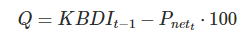

```{r setup, include=FALSE}
library(readr)
library(ggplot2)
library(lubridate)
library(dplyr)
library(ReIns)
library(extRemes)
library(evd)
library(firebehavioR)
library(cffdrs)
library(here)

# Setup of options for the rmarkdown document
knitr::opts_chunk$set(echo = TRUE, # By default, codes are shown
                      warning = FALSE, # Warnings are not printed
                      message = FALSE, # Messages are not printed
                      out.width = "90%",
                      cache = FALSE,
                      fig.align = 'center') # Codes results are cached into a 
# dedicated _cache directory which should be ignored by git (and emptied regularly)

## https://bookdown.org/yihui/rmarkdown/markdown-syntax.html pour des tips

```

# Introdution

Les feux de forêt attirent souvent l’attention des médias en tant que des évènements marquants, comme le récent grand feu dans le Var en août 2021, les feux catastrophiques qui ont touchés les États-Unis, la Grèce ou l’Algérie en 2021. En réalité, ces phénomènes ne sont que la face émergée de l’iceberg. En effet, la fréquence de feux de forêts dans le Sud-Est de la France est d'un par semaine, mais sans déclencher de catastrophe grâce à une politique de prévention et de prédiction efficace. L’analyse de l’occurrence de ces feux permet de comprendre et de quantifier les facteurs associés à leur émergence, mais également à leur propagation initiale. 
Les statistiques modernes, particulièrement la théorie des valeurs extrêmes, permettent d’appréhender la dimension probabiliste de l’activité des feux, ainsi que les différents facteurs associés :  météorologie, climatique, environnemental ou humaine. De plus, on s’attend à ce que le danger d’incendies augmente avec le changement climatique en raison d’une influence renforcée des facteurs de risques météorologiques.
Ce projet se concentrera sur les facteurs météorologiques. Une variable explicative utile pour représenter le niveau de danger quotidien est l’indice feux-météo (IFM), qui intègre les effets de la température, du vent, des précipitations et de l’humidité de l’air sur le niveau de danger incendie selon le type de l’indice que nous avons choisi, et dans ce projet on se concentre sur quatre IFM :  Angstrom Index, Fosberg Fire Weather Index, The Mark 5 forest fire danger index et Canadian forest fire weather index.
Nous utiliserons les données météorologiques journalières relevées à la station en région méditerranéenne de Salon-de-Provence pour la période 1981–2020.

# Indices étudiés  {.tabset}

## MacArthur Grassland Mark 5 Index

L'indice de danger d'incendie de forêt de McArthur (FFDI) est largement utilisé en Australie comme base pour l'émission d'avertissements météorologiques en cas d'incendie. Il est associé à un ensemble de seuils de classification allant de faible à extreme que l'on peut voir ci-dessous:

````{r}
knitr::include_graphics("Tab_seuil_indice.png")
````

La formulation de l'indice FFDI prend en compte la température du jour à 15H( °C), T, la vitesse du vent (km/h), v, et l'humidite relative (%), RH. Il y'a egalement une composante représentant la disponibilité du combustible appelée le facteur de sécheresse, DF.
Nous verrons la formule mathematique associee dans la prochaine partie.

# Discussion comparative des formules

## Variables d'entrée {.tabset}

### Fosberg Fire Weather Index (FFWI)


L'indice feu-météo de Fosberg (The Fosberg Fire Weather Index) est un indice pour estimer le danger d'incendie développé par Fosberg (1978). Il est basé sur la teneur en humidité à l'équilibre (Equilibrium Moisture Content) et la vitesse du vent (Wind speed). Il nécessite des observations horaires de la température, de l'humidité relative de l'air et de la vitesse du vent comme données d'entrée.

Il a ?t? con?u pour ?valuer l'impact des variations m?t?orologiques ? petite ?chelle et ? court terme sur le potentiel d'incendie et est tr?s sensible aux changements de l'humidit? du combustible fin.

L'indice FFWI est corr?l? avec l'occurrence des incendies dans le nord-est et le sud-ouest des ?tats-Unis par construction.
### MacArthur Grassland Mark 5 Index

L'indice McArthur est basé sur les valeurs quotidiennes de la température, de l'humidité relative, de la vitesse du vent et des précipitations des dernières 24 heures. C'est ce qu'on appelle un indice dynamique puisqu'il depend desconditions meteorologiques des jours precedents.Voici la formule mathematique associee a cet indice :

````{r}
knitr::include_graphics("Mc arthur.png")
````

ou H15 est l'humidité relative de l'air [%], T15 la température de l'air [°C], U15 la vitesse du vent [km/h] et DF un facteur de sécheresse exprimé en fonction de l'indice KBDI (comme on l'a vu plus haut), la formule de ce dernier est la suivante :

````{r}
knitr::include_graphics("Mc arthur2.png")
````

Le coeffecient KBDI est calculé de la façon suivante :

````{r}
knitr::include_graphics("KBDI.png")
````

Avec Q qui vaut :

````{r}

````


### Angstrom Index


L'Angstrom Index est un indice créé en Suède. Son objectif est simple : être calculable mentalement.
````{r}

````
T~13~ et H~13~ correspondent respectivement à la température à 13h en °C et à l'humidité à 13h.

## Statique vs Dynamique {.tabset}

### Fosberg Fire Weather Index (FFWI)

L'indice FFWI est statique puisque son calcul n'est pas basé sur les valeurs précédentes et aucune initialisation est nécessaire pour faire le calcul. En effet, nous avons besoin seulement de la valeur horaire des :
H : Humidité de l'aire en pourcentage
U : la vitesse de vent en mph
T : la température en °F
En revanche, le calcul se base sur des sous-fonctions comme EMC.

### Angstrom Index

Il s'agit également d'un indice statique.


# Implémentation des calculs {.tabset}

Nous commençons par exploiter les données recueillies par la station de Salon-de-Provence.
Nous avons également utilisé la base de données en ligne Prométhée afin de recueillir la totalité des incendies ayant eu lieu sur la période étudiée dans le département. Cela nous permettra de confronter les indices avec la réalité.   

```{r data_loading, warning=FALSE, message=FALSE, cache=TRUE}
  RR_81_99 <- read_delim("data/Construction_FWI_horaire_METEO_STATION_RR_81-99.csv",delim = ";", escape_double = FALSE, trim_ws = TRUE)
  RR_2000_2021 <- read_delim("data/Construction_FWI_horaire_METEO_STATION_RR_2000-2021.csv", delim = ";", escape_double = FALSE, trim_ws = TRUE)
  T_81_99 <- read_delim("data/Construction_FWI_horaire_METEO_STATION_T_81-99.csv", delim = ";", escape_double = FALSE, trim_ws = TRUE)
  T_2000_2021 <- read_delim("data/Construction_FWI_horaire_METEO_STATION_T_2000-2021.csv", delim = ";", escape_double = FALSE, trim_ws = TRUE)
  U_81_99 <- read_delim("data/Construction_FWI_horaire_METEO_STATION_U_81-99.csv", delim = ";", escape_double = FALSE, trim_ws = TRUE)
  U_2000_2021 <- read_delim("data/Construction_FWI_horaire_METEO_STATION_U_2000-2021.csv", delim = ";", escape_double = FALSE, trim_ws = TRUE)
  VT_81_99 <- read_delim("data/Construction_FWI_horaire_METEO_STATION_VT_81-99.csv", delim = ";", escape_double = FALSE, trim_ws = TRUE)
  VT_2000_2021 <- read_delim("data/Construction_FWI_horaire_METEO_STATION_VT_2000-2021.csv", delim = ";", escape_double = FALSE, trim_ws = TRUE)
  Incendie_81_2021 <- read_delim("data/liste_incendies_91_2021.csv", delim=";", escape_double = FALSE, trim_ws = TRUE)
```

## Fosberg Fire Weather Index (FFWI)


### Concaténation des données 

On va tout d'abord combiner les données pour avoir une seul base de données de 1981 à 2021.

```{r }

U_complet<- rbind(U_81_99,U_2000_2021)
VT_complet<- rbind(VT_81_99,VT_2000_2021)
T_complet<- rbind(T_81_99,T_2000_2021)
RR_complet<- rbind(RR_81_99,RR_2000_2021)

length(RR_complet$RR)
length(T_complet$T)

```

###  Gestion des valeurs manquantes 

Cette partie consiste à gérer les valeurs NAN dans notre base de Nous essyons de savoir le nombre exact de valeurs manquantes dans chaque colonne.

```{r}

263232-length(na.omit(T_complet$T))

263232-length(na.omit(VT_complet$VT))

263232-length(na.omit(U_complet$U))

263232-length(na.omit(RR_complet$RR))

```

Ensuite, nous allons récupérer la moyenne de chaque variable météorologique afin de remplacer les valeurs NAN.

```{r}

mean(na.omit(RR_complet$RR))

mean(na.omit(T_complet$T))

mean(na.omit(VT_complet$VT))

mean(na.omit(U_complet$U))

```

Alors, on remplace les NAN par la moyenne et on remarque que effectivement il n'y a plus de valeurs manquantes puisque la longueur est :

```{r}

RR_complet[is.na(RR_complet)]<-0.06693427
T_complet[is.na(T_complet)]<-14.59049
VT_complet[is.na(VT_complet)]<-13.60234
U_complet[is.na(U_complet)]<-67.76571

length(na.omit(RR_complet$RR))
length(na.omit(T_complet$T))
length(na.omit(VT_complet$VT)) 
length(na.omit(U_complet$U))

```


### Calcul de FFWI :

Le calcul des indices se fait par les formules ci-dessous :


#### EMC :

```{r }

EMC <- function(H,t) {
  
  
  if (H < 10 )  {
    resu <- 0.03229 + 0.281073*H - 0.000578*H*t
    
  } 
  
  else { 
    if (H >= 50) {
    resu <- 21.0606 + 0.005565*H*H - 0.00035*H*t - 0.483199*H
    
    } 
  
   else {
    resu <- 2.22749 + 0.160107*H - 0.01478*t
  } }
  
  return(resu)
}

```

#### Nu :


```{r }

nu <- function(H,t){
  
  resu2=1 -2*((EMC(H,t))/30) + 1.5*((EMC(H,t))/30)*((EMC(H,t))/30) + 0.5*((EMC(H,t))/30)*((EMC(H,t))/30)*((EMC(H,t))/30)
  
  return(resu2)
}


```

#### FFWI :


```{r }

FFWI<- function(H,t,V){return((nu(H,t)*sqrt(1+V*V))/0.3002)}

FFWI(U_complet$U[length(U_complet)],T_complet$T[length(T_complet)],VT_complet$VT[length(VT_complet)])
```
Donc, la dernière valeur de l'indice est bien 6.318553.


```{r }
FFwi_values<-cbind(T_complet)
names(FFwi_values)[names(FFwi_values) == "T"] <- "FFwi"
 
FFwi_values$FFwi[1]<-0
FFwi_values$FFwi[2]<-0


for (i in 1:length(FFwi_values$FFwi))  {
    
    FFwi_values$FFwi[i]<- FFWI(U_complet$U[i],T_complet$T[i],VT_complet$VT[i])
 
  }


```


## FWI Canadien
```` {r}
RR_12h <- rbind(RR_81_99[RR_81_99$HEURE == 12,],RR_2000_2021[RR_2000_2021$HEURE == 12,])
T_12h <- rbind(T_81_99[T_81_99$HEURE == 12,],T_2000_2021[T_2000_2021$HEURE == 12,])
U_12h <- rbind(U_81_99[U_81_99$HEURE == 12,],U_2000_2021[U_2000_2021$HEURE == 12,])
VT_12h <- rbind(VT_81_99[VT_81_99$HEURE == 12,],VT_2000_2021[VT_2000_2021$HEURE == 12,])

names(RR_12h)[6] <- "prec"
names(T_12h)[6] <- "temp"
names(U_12h)[6] <- "rh"
names(VT_12h)[6] <- "ws"

Diff_date <- as.numeric(difftime(as.Date("1991-10-01"), as.Date("1970-01-01"), units = "days"))
col_datee <- vector(mode = "logical", nrow(RR_12h))
for (i in 1:nrow(RR_12h)){
  col_datee[i] <- Diff_date + i - 1
}
A <- as.data.frame(col_datee)
A <- as.Date(A$col_datee, origin = "1970-01-01")

donnee_12h <- merge(merge(merge(RR_12h, T_12h), U_12h), VT_12h)
fwi_resultat_total = fwi(input = na.omit(cbind(A, donnee_12h)))

fwi_et_donnees = fwi_resultat_total
fwi_et_donnees = fwi_et_donnees[c("A", "AN", "MOIS", "JOUR", "HEURE", "FWI", "PREC", "TEMP", "RH", "WS")]
fwi_resultat = fwi_et_donnees
fwi_resultat = fwi_resultat[c("A", "AN", "MOIS", "JOUR", "HEURE", "FWI")]
````

## Angstrom Index

```{r angstrom_implementation, cache=TRUE}
T_13h <- rbind(T_81_99[T_81_99$HEURE == 13,],T_2000_2021[T_2000_2021$HEURE == 13,])
U_13h <- rbind(U_81_99[U_81_99$HEURE == 13,],U_2000_2021[U_2000_2021$HEURE == 13,])
  
Angstrom_Index <- data.frame(matrix(ncol=7,nrow=nrow(T_13h)))
colnames(Angstrom_Index) <- c("DATE", "AN", "MOIS", "JOUR","ANGSTROM_INDEX", "U", "T")

for(i in 1:nrow(Angstrom_Index))
{
  ligne_humidite <- U_13h[i,]
  ligne_temperature <- T_13h[T_13h$AN == ligne_humidite$AN & T_13h$MOIS == ligne_humidite$MOIS & T_13h$JOUR == ligne_humidite$JOUR,]
  
  index <- (ligne_humidite$U / 20) + (27 - ligne_temperature$T)/10
  
  Angstrom_Index[i,] <- c(as.Date(gsub(" ", "", paste(ligne_humidite$JOUR,"/",ligne_humidite$MOIS,"/",ligne_humidite$AN)),format="%d/%m/%Y", origin="1970-01-01"),ligne_humidite$AN, ligne_humidite$MOIS, ligne_humidite$JOUR, index, ligne_humidite$U, ligne_temperature$T)

}


nb_iteration = nrow(Angstrom_Index)
Index_Summer_Angstrom <- data.frame(DATE=numeric(), AN=numeric(), MOIS=numeric(), JOUR=numeric(),ANGSTROM_INDEX=numeric(), U = numeric(), T=numeric(), stringsAsFactors=FALSE)

for (i in 1:nb_iteration){
  month <- month(as.Date(Angstrom_Index[i,]$DATE, origin="1970-01-01"))
  if(month == 6 || month == 7 || month == 8){
      Index_Summer_Angstrom[nrow(Index_Summer_Angstrom)+1,] <- Angstrom_Index[i,]
  }
}
  
```

## MacArthur Grassland Mark 5 Index

```{r Mcarthur_implementation, cache=TRUE}

RR_15h <- rbind(RR_81_99[RR_81_99$HEURE == 15,],RR_2000_2021[RR_2000_2021$HEURE == 15,])
T_15h <- rbind(T_81_99[T_81_99$HEURE == 15,],T_2000_2021[T_2000_2021$HEURE == 15,])
U_15h <- rbind(U_81_99[U_81_99$HEURE == 15,],U_2000_2021[U_2000_2021$HEURE == 15,])
VT_15h <- rbind(VT_81_99[VT_81_99$HEURE == 15,],VT_2000_2021[VT_2000_2021$HEURE == 15,])


Diff_date <- as.numeric(difftime(as.Date("1991-10-01"), as.Date("1970-01-01"), units = "days"))

col_datee <- vector(mode = "logical", nrow(RR_15h))
for (i in 1:nrow(RR_15h)){
  col_datee[i] <- Diff_date + i - 1
}

A <- as.data.frame(col_datee)
A <- as.Date(A$col_datee, origin = "1970-01-01")

rr <- RR_15h[,6]
t <- T_15h[,6]
u <- U_15h[,6]
vt <- VT_15h[,6]


McArthur_Data <- cbind.data.frame(A,t,u,vt,rr)


years=as.numeric(format(as.Date(McArthur_Data$col_datee, format = "%Y-%m-%d"), "%Y"))


McArthur_Data_ma = subset(McArthur_Data, U <= 70 & T >= 10 & U > 42.5 - 1.25 * T & 
                     U < 94.5 - 1.35 * T)

indices_McArthur = data.frame(c(1:10968))
indices_McArthur = fireIndex(McArthur_Data$T, McArthur_Data$VT, McArthur_Data$U)
indices_McArthur$Date <- NULL
indices_McArthur$angstrom <- NULL
indices_McArthur$hotDryWindy <- NULL
indices_McArthur$fuelMoisture <- NULL
indices_McArthur$fosberg <- NULL
indices_McArthur$chandler <- NULL
indices_McArthur$grasslandMk4 <- NULL
indices_McArthur$Chandler <- NULL


indices_McArthur <- cbind(A,indices_McArthur)
plot(indices_McArthur$A, indices_McArthur$grasslandMk5, type ="h")

```

La fonction fireIndexKBDI faisant apparaitre une erreur malgré les bons paramètres, nous nous sommes résolus à utiliser la fonction fireIndex qui évidemment envoie un résultat différent car statique... 


```{r, child=c('analyses_indices.Rmd', 'analyses_indices2.Rmd')}
```

# Analyse par rapport aux données d'entrée {.tabset}

## Fosberg Fire Weather Index (FFWI)


```{r FFWI_input_temperature}
### plotting temperatures within chosen range ###

#date_debut <- as.Date("01/06/2020","%d/%m/%Y")
#date_fin <- as.Date("31/12/2021","%d/%m/%Y")

ggplot(data = graph_T,
       mapping = aes(x = as.Date(DATE, origin="1970-01-01"), y =T, color =T)) +
  geom_point() +
  scale_color_gradient(guide="none", low="green", high="red") +
  labs(x = "Date", y = "Temperatures") +
  geom_point(data = graph_T %>% filter(as.Date(DATE, origin="1970-01-01") %in% as.Date.character(Incendies_filtered$Alerte,format="%d/%m/%Y %H:%M", origin="1970-01-01")),
             pch=16, size=2, colour="black")


quant = 0.95

FFWI_Index_omit <- na.omit(FFwi_values)

FFWI_Index_omit_reverse <- FFWI_Index_omit
FFWI_Index_omit_reverse$FFwi <- FFWI_Index_omit_reverse$FFwi *-1

min_FFWI_Index_omit_reverse <- min(FFWI_Index_omit_reverse$FFwi)

FFWI_Index_omit_reverse$FFwi <- FFWI_Index_omit_reverse$FFwi - min_FFWI_Index_omit_reverse +1

extremal_correlation_input_output(FFWI_Index_omit_reverse$T, FFWI_Index_omit_reverse$FFwi,quant)

```


````{r FFWI_input_Humidité}

### plotting humidty within chosen range ###

ggplot(data = graph_U,
       mapping = aes(x = as.Date(DATE, origin="1970-01-01"), y = U, color = U)) +
  geom_point() +
  scale_color_gradient(guide="none", low="red", high="green") +
  labs(x = "Date", y = "Humidit?") +
  geom_point(data = graph_U %>% filter(as.Date(DATE, origin="1970-01-01") %in% as.Date.character(Incendies_filtered$Alerte,format="%d/%m/%Y %H:%M", origin="1970-01-01")),
             pch=16, size=2, colour="black")

extremal_correlation_input_output(U_complet$U,FFwi_values$FFwi,quant)

````


## FWI Canadien

Nous allons analyser la sensibilité du FWI Canadien par rapport au différente variable d'entrée.
Nous utilisons une corrélation inverse pour l'humidité et les précipitations, car plus ces paramètres sont, moins il y a de risque d'incendies.

```{r FWI_input_temperature}

quant = 0.95

FWI_Index_omit <- na.omit(fwi_et_donnees)
min_FWI_Index_omit <- min(FWI_Index_omit$FWI)
FWI_Index_omit$FWI <- FWI_Index_omit$FWI - min_FWI_Index_omit +1

FWI_Index_omit_reverse <- FWI_Index_omit
FWI_Index_omit_reverse$FWI <- FWI_Index_omit_reverse$FWI *-1
min_FWI_Index_omit_reverse <- min(FWI_Index_omit_reverse$FWI)
FWI_Index_omit_reverse$FWI <- FWI_Index_omit_reverse$FWI - min_FWI_Index_omit_reverse +1

extremal_correlation_input_output(FWI_Index_omit$TEMP, FWI_Index_omit$FWI,quant)
extremal_correlation_input_output(FWI_Index_omit$PREC, FWI_Index_omit_reverse$FWI,quant)
extremal_correlation_input_output(FWI_Index_omit$RH, FWI_Index_omit_reverse$FWI,quant)
extremal_correlation_input_output(FWI_Index_omit$WS, FWI_Index_omit$FWI,quant)

```

Nous constatons que la corrélation la plus élevée correspond à celle avec la vitesse du vent, et que la corrélation avec la température est la plus faible. Ce qui permet de conclure que le FWI Canadien est plus sensible à la vitesse du vent qu'aux autres paramètres, et que le paramètre le moins impactant est la température.


## Angstrom Index

Nous allons commencer par analyser la sensibilité de cet indice par rapport à la température.
Afin d'avoir des extrêmes qui correspondent, nous inversons les valeurs de l'indice (étant donné que de base, une valeur faible indique un potentiel plus élevé d'incendie).

```` {r angstrom_input_temperature, warning=FALSE}
### plotting temperatures within chosen range ###

ggplot(data = graph_angstrom_index,
       mapping = aes(x = as.Date(DATE, origin="1970-01-01"), y = T, color = T, xmin = date_debut,xmax=date_fin)) +
  geom_point() +
  scale_color_gradient(guide="none", low="green", high="red") +
  labs(x = "Date", y = "Temperatures") +
  geom_point(data = graph_angstrom_index %>% filter(as.Date(DATE, origin="1970-01-01") %in% as.Date.character(Incendies_filtered$Alerte,format="%d/%m/%Y %H:%M", origin="1970-01-01")),
             pch=16, size=2, colour="black")

quant = 0.95

Angstrom_Index_omit <- na.omit(Angstrom_Index)

Angstrom_Index_omit_reverse <- Angstrom_Index_omit
Angstrom_Index_omit_reverse$ANGSTROM_INDEX <- Angstrom_Index_omit_reverse$ANGSTROM_INDEX *-1
min_Angstrom_Index_omit_reverse <- min(Angstrom_Index_omit_reverse$ANGSTROM_INDEX)
Angstrom_Index_omit_reverse$ANGSTROM_INDEX <- Angstrom_Index_omit_reverse$ANGSTROM_INDEX - min_Angstrom_Index_omit_reverse +1

extremal_correlation_input_output(Angstrom_Index_omit_reverse$T, Angstrom_Index_omit_reverse$ANGSTROM_INDEX,quant)

````
Pour étudier la sensibilité vis-à-vis de l'humidité, nous n'utilisons pas les valeurs inversées de l'indice car nous voulons vérifier une corrélation inversée : lorsque l'humidité est très élevée, il est cohérent d'attendre un indice indiquant un risque moins élevé d'incendies, et donc une valeur élevée.

````{r angstrom_input_humidity, warning=FALSE}
### plotting humidty within chosen range ###

ggplot(data = graph_angstrom_index,
       mapping = aes(x = as.Date(DATE, origin="1970-01-01"), y = U, color = U, xmin = date_debut,xmax=date_fin)) +
  geom_point() +
  scale_color_gradient(guide="none", low="red", high="green") +
  labs(x = "Date", y = "Temperatures") +
  geom_point(data = graph_angstrom_index %>% filter(as.Date(DATE, origin="1970-01-01") %in% as.Date.character(Incendies_filtered$Alerte,format="%d/%m/%Y %H:%M", origin="1970-01-01")),
             pch=16, size=2, colour="black")

extremal_correlation_input_output(Angstrom_Index_omit$U,Angstrom_Index_omit$ANGSTROM_INDEX,quant)

````
Nous trouvons une corrélation inversée plus élevée que la corrélation avec la température, ce qui permet de conclure que l'indice Angstrom est légèrement plus sensible à la sécheresse qu'à la température.

## MacArthur Grassland Mark 5 Index

````{r}

indice_1AN <- indices_McArthur$grasslandMk5[10602:10967]
plot(indices_McArthur$A[10602:10967], indice_1AN, type = "b")
plot(McArthur_Data$A[10602:10967], McArthur_Data$T[10602:10967], type = "b")
plot(McArthur_Data$A[10602:10967], McArthur_Data$U[10602:10967], type = "b")
plot(McArthur_Data$A[10602:10967], McArthur_Data$VT[10602:10967], type = "b")
````

On a au dessus les courbes sur une année de l'indice, et de chaque variable d'entrée, cela donne un première vision de la corrélation entre les données. La température semble correspondre aux tendances de l'indice tandis que l'humidité relative au contraire semble avoir une corrélation négative avec l'indice. Appliquons cela au cas des valeurs extremes.

````{r}

quant = 0.95
indices_omit <- fireIndex(McArthur_Data$T, McArthur_Data$VT, McArthur_Data$U)
indices_omit$Date <- NULL
indices_omit$angstrom <- NULL
indices_omit$hotDryWindy <- NULL
indices_omit$fuelMoisture <- NULL
indices_omit$fosberg <- NULL
indices_omit$chandler <- NULL
indices_omit$grasslandMk4 <- NULL
indices_omit$Chandler <- NULL
indices_omit <- cbind.data.frame(A,indices_omit,McArthur_Data$T,McArthur_Data$U,McArthur_Data$VT,McArthur_Data$RR)
indices_omit <- na.omit(indices_omit)
extremal_correlation_input_output(indices_omit$`McArthur_Data$T`, indices_omit$grasslandMk5,quant)
extremal_correlation_input_output(indices_omit$`McArthur_Data$U`, indices_omit$grasslandMk5,quant)
extremal_correlation_input_output(indices_omit$`McArthur_Data$VT`, indices_omit$grasslandMk5,quant)
extremal_correlation_input_output(indices_omit$`McArthur_Data$RR`, indices_omit$grasslandMk5,quant)
````

En comparant les valeurs extremes d'indices avec les variables d'entrée, on s'aperçoit qu'il y'a une forte correlation (0,77) entre un indice élevé et des temperatures élevées. On constate aussi une corrélation un peu moindre (0,38) avec la vitesse du vent (variable qui normalement a une grande influence sur le KBDI). La corrélation est nulle pour les 2 autres variables, cela paraît plutôt incoherent. 

# Conclusion

Finalement, nous arrivons presque atteindre les objectifs fixés en début du projet, en commençant par la compréhension des indices jusqu’à l’estimation des valeurs extrémales dans nos indices. Nous avons appris énormément des concepts en statistique et des compétences en programmation précisément en langage R qui a été au début de projet totalement nouveau pour nous. Effectivement, nous avons rencontré des problèmes durant le projet notamment technique puisque certains indices se caractérisent par une structure complexe. De plus, nous sommes restés bloquer un peu au début puisque le projet est basé sur le cours des valeurs extrêmes que nous venons de suivre récemment.
En bref, les indices IFM est dépendent fortement de la région, et il faut adapter chacun dans une région compatible par sa construction pour obtenir des résultats pertinents en termes de prédiction des incendies, par exemple nous avons bien décrit les grands incendies dans le départmement par Angstrom mais FFWI n’a pas donné un résultat pertinent. Du surcroît, l’impact d’une variable météorologique est différent dans chaque indice, il ne faut pas croire que toujours la température est le seul facteur responsable : par exemple dans l’indice FFWI, on a trouvé que les maximums sont plutôt synchronisés avec la vitesse de vent.